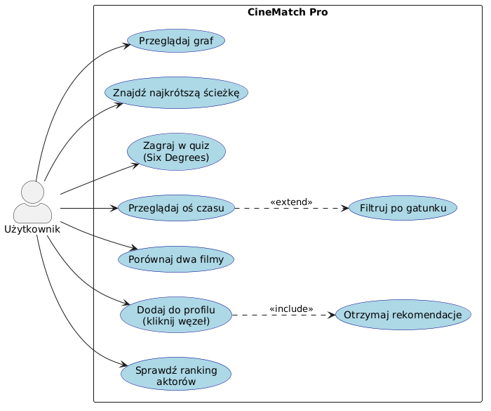
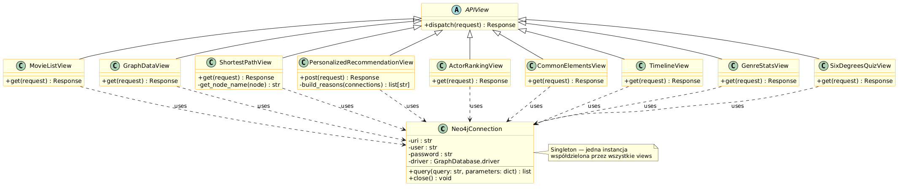
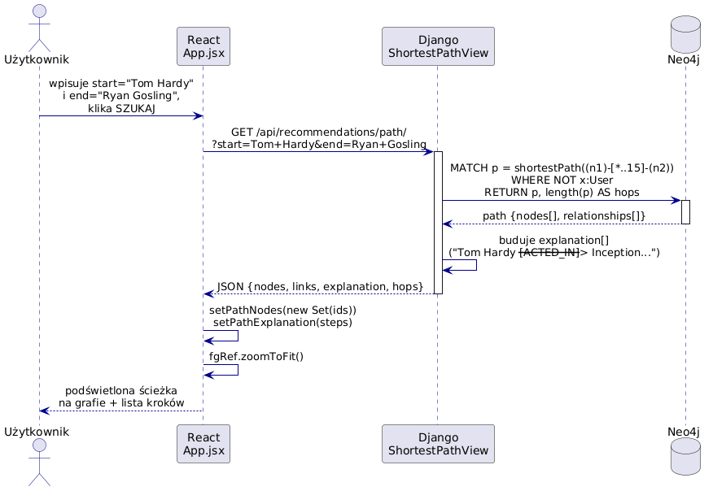
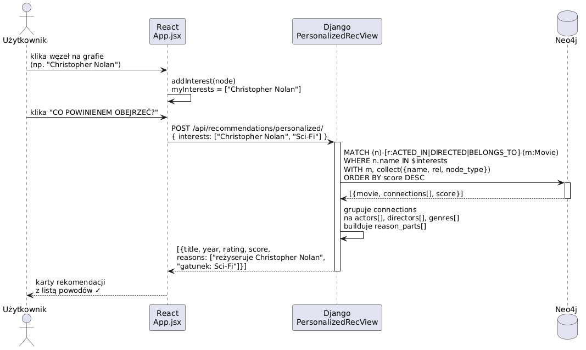
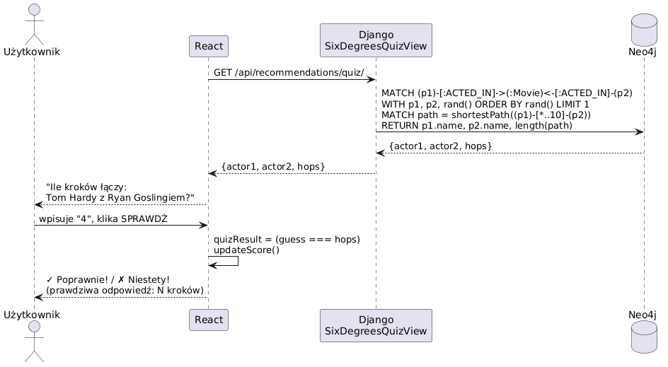

# CineMatch Pro — Dokumentacja Projektu

**Technologia bazy:** Neo4j
**Architektura:** Django + React  

---

## Spis treści

1. [Opis projektu](#1-opis-projektu)
2. [Struktura grafu Neo4j](#3-struktura-grafu-neo4j)
3. [Diagramy UML](#4-diagramy-uml)
4. [Endpointy REST API](#6-endpointy-rest-api)
5. [Zapytania Cypher](#7-zapytania-cypher)
6. [Wdrożenie](#8-wdrożenie)

---

## 1. Opis projektu

**CineMatch Pro** to aplikacja webowa SPA wykorzystująca grafową bazę danych **Neo4j** do analizy powiązań między filmami, aktorami, reżyserami i gatunkami oraz do generowania spersonalizowanych rekomendacji filmowych.

### Funkcjonalności

| # | Funkcja | Opis |
|---|---------|------|
| 1 | **Interaktywny graf** | Wizualizacja węzłów i relacji w czasie rzeczywistym (react-force-graph-2d) |
| 2 | **Najkrótsza ścieżka** | Algorytm `shortestPath` łączy dowolne dwa węzły z wyjaśnieniem każdego kroku |
| 3 | **Quiz Six Degrees** | Użytkownik zgaduje dystans grafowy między losową parą aktorów |
| 4 | **Oś czasu** | Chronologiczny przegląd filmów z filtrowaniem po gatunku |
| 5 | **Porównanie filmów** | Zapytanie grafowe ujawnia wspólnych aktorów, reżyserów, gatunki |
| 6 | **Rekomendacje** | Algorytm grafowy na podstawie wybranych węzłów z pełnym uzasadnieniem |
| 7 | **Ranking** | Aktorzy z największą liczbą połączeń, sortowani po liczbie filmów i ocenie |

### Stos technologiczny

| Warstwa | Technologia |
|---------|-------------|
| Baza danych | Neo4j |
| Backend | Django REST Framework |
| Frontend | React |

---

## 2. Struktura grafu Neo4j

### Model danych — węzły

```
╔══════════════════╗     ╔══════════════════╗     ╔══════════════════╗
║     :Movie       ║     ║     :Person      ║     ║     :Genre       ║
╠══════════════════╣     ╠══════════════════╣     ╠══════════════════╣
║ title   : String ║     ║ name    : String ║     ║ name    : String ║
║ year    : Integer║     ╚══════════════════╝     ╚══════════════════╝
║ rating  : Float  ║
╚══════════════════╝
```

### Model danych — relacje

```
(:Person) -[:ACTED_IN  {role: String}]-> (:Movie)
(:Person) -[:DIRECTED]->                 (:Movie)
(:Movie)  -[:BELONGS_TO]->               (:Genre)
(:Person) -[:FRIENDS_WITH]->             (:Person)
```

### Diagram węzłów i relacji

```
                    ┌──────────────┐
                    │   :Person    │
                    │  name: str   │
                    └──────┬───┬──┘
                           │   │
              DIRECTED ────┘   └──── ACTED_IN {role}
                           │   │
                           ▼   ▼
                    ┌──────────────┐         ┌──────────────┐
                    │   :Movie     │─────────▶│   :Genre     │
                    │  title: str  │BELONGS_TO│  name: str   │
                    │  year: int   │         └──────────────┘
                    │  rating: flt │
                    └──────────────┘

    (:Person) ──FRIENDS_WITH──▶ (:Person)
```

### Statystyki bazy

| Element | Liczba |
|---------|--------|
| Węzły `Movie` | ~35 |
| Węzły `Person` | ~40 |
| Węzły `Genre` | 8 |
| **Razem węzłów** | **~83** |
| **Razem relacji** | **~123** |

### Przykładowy fragment grafu

```
(Christopher Nolan) ──DIRECTED──▶ (Inception) ──BELONGS_TO──▶ (Sci-Fi)
                                       ▲
                     ┌─────────────────┤
                     │                 │
          (Leonardo DiCaprio)    (Tom Hardy)
          ACTED_IN role=Cobb     ACTED_IN role=Eames

(Christopher Nolan) ──DIRECTED──▶ (The Dark Knight)
                                       ▲
                     ┌─────────────────┼──────────────────┐
                     │                 │                  │
               (Tom Hardy)      (Christian Bale)   (Cillian Murphy)
               role=Bane        role=Batman         role=Scarecrow
```

---

## 3. Diagramy UML

### 3.1 Diagram przypadków użycia



---

### 3.2 Diagram klas backendu



---

### 3.3 Diagram sekwencji — Najkrótsza ścieżka



---

### 3.4 Diagram sekwencji — Personalizowane rekomendacje



---

### 3.5 Diagram sekwencji — Quiz Six Degrees



---

## 4. Endpointy REST API

| Endpoint | Metoda | Parametry | Opis |
|----------|--------|-----------|------|
| `/api/movies/list/` | GET | – | Lista wszystkich filmów |
| `/api/movies/graph/` | GET | – | Węzły i relacje do grafu |
| `/api/recommendations/path/` | GET | `start`, `end` | Najkrótsza ścieżka |
| `/api/recommendations/personalized/` | POST | `{interests:[]}` | Rekomendacje |
| `/api/recommendations/ranking/` | GET | – | Ranking aktorów |
| `/api/recommendations/common/` | GET | `movie1`, `movie2` | Wspólne elementy |
| `/api/recommendations/timeline/` | GET | `genre` (opcj.) | Oś czasu |
| `/api/recommendations/genres/` | GET | – | Statystyki gatunków |
| `/api/recommendations/quiz/` | GET | – | Para do quizu + dystans |

### Przykładowe odpowiedzi

#### GET `/api/recommendations/path/?start=Tom+Hardy&end=Ryan+Gosling`

```json
{
  "hops": 4,
  "explanation": [
    "Tom Hardy —[ACTED_IN: Eames]→ Inception",
    "Inception ←[ACTED_IN: Cobb]— Leonardo DiCaprio",
    "Leonardo DiCaprio —[ACTED_IN: Rick Dalton]→ Once Upon a Time in Hollywood",
    "Once Upon a Time in Hollywood ←[ACTED_IN: Cliff Booth]— Brad Pitt"
  ],
  "nodes": [{"id": "...", "name": "Tom Hardy", "label": "Person"}, "..."],
  "links": [{"source": "...", "target": "...", "type": "ACTED_IN"}, "..."]
}
```

#### POST `/api/recommendations/personalized/`

```json
// Request:
{ "interests": ["Christopher Nolan", "Sci-Fi", "Tom Hardy"] }

// Response:
[
  {
    "title": "Tenet",
    "year": 2020,
    "rating": 7.4,
    "score": 3,
    "connections": 3,
    "reasons": [
      "Tom Hardy gra w tym filmie",
      "reżyseruje Christopher Nolan",
      "gatunek: Sci-Fi"
    ]
  },
  {
    "title": "Inception",
    "year": 2010,
    "rating": 8.8,
    "score": 2,
    "connections": 2,
    "reasons": [
      "reżyseruje Christopher Nolan",
      "gatunek: Sci-Fi"
    ]
  }
]
```

#### GET `/api/recommendations/quiz/`

```json
{
  "actor1": "Margot Robbie",
  "actor2": "Cillian Murphy",
  "hops": 3
}
```

---

## 5. Zapytania Cypher

### Zasilanie bazy — przykład (seed_db.py)

```cypher
// Tworzenie węzłów
CREATE (nolan:Person {name: 'Christopher Nolan'}),
       (inc:Movie    {title: 'Inception', year: 2010, rating: 8.8}),
       (sf:Genre     {name: 'Sci-Fi'})

// Tworzenie relacji
CREATE (nolan)-[:DIRECTED]->(inc)
CREATE (inc)-[:BELONGS_TO]->(sf)
CREATE (dicaprio)-[:ACTED_IN {role: 'Cobb'}]->(inc)
```

### Czyszczenie bazy

```cypher
MATCH (n) DETACH DELETE n
```

### Wszystkie filmy z reżyserem

```cypher
MATCH (d:Person)-[:DIRECTED]->(m:Movie)
RETURN d.name AS director, m.title AS title,
       m.year AS year, m.rating AS rating
ORDER BY m.rating DESC
```

### Najkrótsza ścieżka między dwoma węzłami

```cypher
MATCH (n1), (n2)
WHERE (n1.name = 'Tom Hardy' OR n1.title = 'Tom Hardy')
  AND (n2.name = 'Ryan Gosling' OR n2.title = 'Ryan Gosling')
MATCH p = shortestPath((n1)-[*..15]-(n2))
WHERE ALL(x IN nodes(p) WHERE NOT x:User)
RETURN p, length(p) AS hops
```

### Personalizowane rekomendacje

```cypher
MATCH (n)
WHERE (n.name IN ['Christopher Nolan', 'Sci-Fi']
    OR n.title IN ['Christopher Nolan', 'Sci-Fi'])
MATCH (n)-[r:ACTED_IN|DIRECTED|BELONGS_TO]-(m:Movie)
WHERE NOT m.title IN ['Christopher Nolan', 'Sci-Fi']
WITH m, n,
     CASE type(r)
       WHEN 'ACTED_IN'   THEN 'gra w'
       WHEN 'DIRECTED'   THEN 'rezyseruje'
       WHEN 'BELONGS_TO' THEN 'gatunek'
     END AS rel_label,
     labels(n)[0] AS node_type
WITH m,
     collect({ name: n.name, rel: rel_label, node_type: node_type }) AS connections,
     count(n) AS score
RETURN m.title, m.year, m.rating, score, connections
ORDER BY score DESC, m.rating DESC
LIMIT 8
```

### Ranking aktorów (PageRank-style)

```cypher
MATCH (p:Person)-[:ACTED_IN]->(m:Movie)
WITH p, count(m) AS film_count,
     avg(m.rating) AS avg_rating,
     collect(m.title) AS titles
ORDER BY film_count DESC, avg_rating DESC
LIMIT 10
RETURN p.name AS name, film_count AS count,
       round(avg_rating * 10) / 10 AS avg_rating, titles
```

### Wspólne elementy dwóch filmów

```cypher
MATCH (m1:Movie {title: 'Inception'})<-[r1]-(x)-[r2]->(m2:Movie {title: 'The Dark Knight'})
RETURN x.name AS element, type(r1) AS rel1,
       type(r2) AS rel2, labels(x)[0] AS type
```

### Statystyki gatunków

```cypher
MATCH (m:Movie)-[:BELONGS_TO]->(g:Genre)
RETURN g.name AS genre,
       count(m) AS count,
       round(avg(m.rating) * 10) / 10 AS avg_rating,
       max(m.rating) AS top_rating,
       collect(m.title)[..3] AS sample_titles
ORDER BY count DESC
```

### Quiz — losowa para z dystansem

```cypher
MATCH (p1:Person)-[:ACTED_IN]->(:Movie)<-[:ACTED_IN]-(p2:Person)
WHERE p1 <> p2
WITH p1, p2, rand() AS r
ORDER BY r LIMIT 1
MATCH path = shortestPath((p1)-[*..10]-(p2))
WHERE ALL(x IN nodes(path) WHERE NOT x:User)
RETURN p1.name AS actor1, p2.name AS actor2, length(path) AS hops
```

---

## 6. Wdrożenie

### Wymagania

- Python 3.11+
- Node.js 18+
- Neo4j Desktop 5.x (lokalnie) lub Neo4j AuraDB (chmura)

### Krok 1 — Neo4j

docker run --name neo4j -p 7474:7474 -p 7687:7687 -d -e NEO4J_AUTH=neo4j/password123 neo4j:latest

### Krok 2 — Backend

```bash
cd backend
python -m venv venv
venv\Scripts\activate          # Windows
# source venv/bin/activate     # Linux/macOS

pip install -r requirements.txt
```

Utwórz plik `.env`:

```
NEO4J_URI=bolt://localhost:7687
NEO4J_USER=neo4j
NEO4J_PASSWORD=twoje_haslo
```

```bash
python manage.py migrate
python seed_db.py
python manage.py runserver
```

### Krok 3 — Frontend

```bash
cd frontend
npm install
npm install react-force-graph-2d axios
npm start
```

### Kolejność uruchamiania

```
1. Uruchom Neo4j  →  2. python seed_db.py  →  3. python manage.py runserver  →  4. npm start
```

### Zmienne środowiskowe

| Zmienna | Przykład | Opis |
|---------|----------|------|
| `NEO4J_URI` | `bolt://localhost:7687` | Adres bazy Neo4j |
| `NEO4J_USER` | `neo4j` | Użytkownik bazy |
| `NEO4J_PASSWORD` | `password123` | Hasło do bazy |
